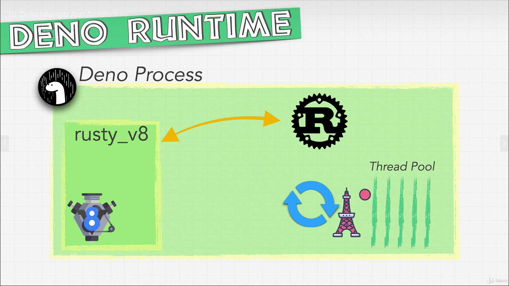
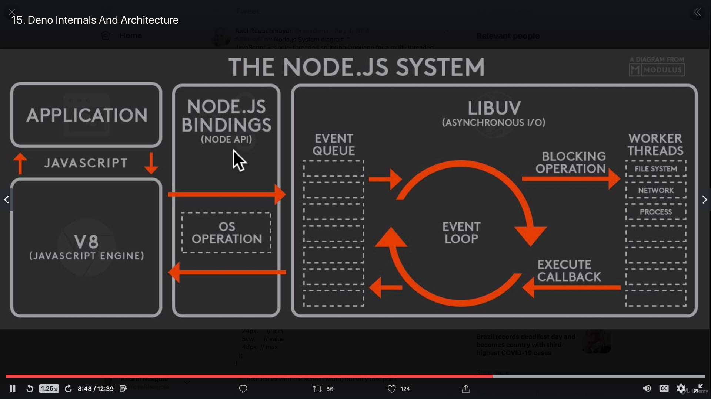
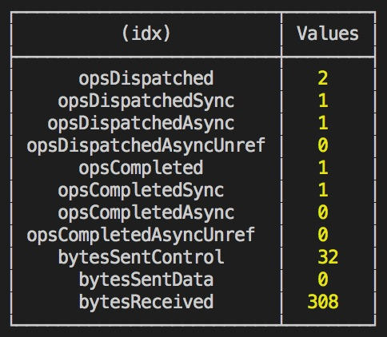

# Deno: The Complete Guide Zero to Mastery

## Table of Contents

- [Deno: The Complete Guide Zero to Mastery](#deno-the-complete-guide-zero-to-mastery)
  - [Table of Contents](#table-of-contents)
  - [Section 2: Deno Foundations](#section-2-deno-foundations)
    - [4. Why Deno?](#4-why-deno)
    - [5. Deno Runtime And V8 Engine](#5-deno-runtime-and-v8-engine)
    - [6. Deno Installation](#6-deno-installation)
    - [7. Quick Note: Installing Deno](#7-quick-note-installing-deno)
    - [10. Setting Up Our Developer Environment](#10-setting-up-our-developer-environment)
    - [11. Quick Note: Official VS Code Plugin](#11-quick-note-official-vs-code-plugin)
    - [12. Our First Deno App](#12-our-first-deno-app)
    - [13. Exercise: Our First Deno App](#13-exercise-our-first-deno-app)
    - [15. Deno Internals And Architecture](#15-deno-internals-and-architecture)
    - [17. Deno Metrics](#17-deno-metrics)
    - [18. Exercise: Deno Architecture](#18-exercise-deno-architecture)
    - [19. Web Developer Monthly](#19-web-developer-monthly)
    - [20. Endorsements On LinkedIN](#20-endorsements-on-linkedin)
  - [Section 3: Deno vs Node](#section-3-deno-vs-node)
    - [21. Deno Game Changers](#21-deno-game-changers)
    - [22. Deno Game Changers 2](#22-deno-game-changers-2)
    - [23. Will Deno Kill NodeJS?](#23-will-deno-kill-nodejs)
    - [24. Single Executable To Rule Them All](#24-single-executable-to-rule-them-all)
    - [25. Deno Security](#25-deno-security)
    - [26. Deno Permissions](#26-deno-permissions)
    - [27. Deno Permissions 2](#27-deno-permissions-2)
    - [28. Deno Permissions 3](#28-deno-permissions-3)
  - [Section 4: Deno Modules And Tooling](#section-4-deno-modules-and-tooling)
  - [Section 5: TypeScript?](#section-5-typescript)
  - [Section 6: Deno File I/O - Planets Project](#section-6-deno-file-io---planets-project)
  - [Section 7: Exercise: SpaceX Launch Data](#section-7-exercise-spacex-launch-data)
  - [Section 8: NASA Project: Deno For Backend Development](#section-8-nasa-project-deno-for-backend-development)
  - [Section 9: NASA Project: Deno Production And The Cloud (Docker + AWS)](#section-9-nasa-project-deno-production-and-the-cloud-docker--aws)
  - [Section 10: Where To Go From Here?](#section-10-where-to-go-from-here)
  - [Section 11: Bonus: How JavaScript Works](#section-11-bonus-how-javascript-works)
  - [Section 12: Bonus: Learning TypeScript](#section-12-bonus-learning-typescript)
  - [Section 13: Bonus: HTTP, AJAX, JSON and APIs](#section-13-bonus-http-ajax-json-and-apis)

## Section 2: Deno Foundations

### 4. Why Deno?

- [Deno](https://deno.land)
- Rust by Mozilla
- TypeScript by Microsoft
- V8 Engine by Google

**[⬆ back to top](#table-of-contents)**

### 5. Deno Runtime And V8 Engine

- JS / TS -> V8 Engine -> Mobile / Web

**[⬆ back to top](#table-of-contents)**

### 6. Deno Installation

```console
curl -fsSL https://deno.land/x/install/install.sh | sh
```

- Deno was installed successfully to /Users/chesterheng/.deno/bin/deno
- Manually add the directory to your $HOME/.bash_profile (or similar)
  - export DENO_INSTALL="/Users/chesterheng/.deno"
  - export PATH="$DENO_INSTALL/bin:$PATH"

```console
open /Users/chesterheng/.deno/bin/deno
/Users/chesterheng/.deno/bin/deno --help
deno
```

**[⬆ back to top](#table-of-contents)**

### 7. Quick Note: Installing Deno

[Deno online editor](https://repl.it/languages/deno#index.ts)

**[⬆ back to top](#table-of-contents)**

### 10. Setting Up Our Developer Environment

```console
deno run deno.js
deno run deno2.ts
```

**[⬆ back to top](#table-of-contents)**

### 11. Quick Note: Official VS Code Plugin

- Download and enable [Visual Studio Code Deno extension](https://marketplace.visualstudio.com/items?itemName=denoland.vscode-deno)
- Enable Deno for your project:
  - Create a file .vscode/settings.json in your project folder:
  ```json
  {
    "deno.enable": true
  }
  ```

**[⬆ back to top](#table-of-contents)**

### 12. Our First Deno App

[✂️ Copy and 📋 Paste Emoji](https://getemoji.com)
[deno doc](https://doc.deno.land/builtin/stable)

```javascript
const food = Deno.args[0]

if(food === 'love') {
  console.log('🦕...Deno is born!')
} else {
  console.log('🥚...this egg needs some love')
}
```

```console
deno run deno.js 'love'
```

**[⬆ back to top](#table-of-contents)**

### 13. Exercise: Our First Deno App

```javascript
const food = Deno.args[0];
const parent = Deno.args[1];
if (food === 'love' && parent === 'ryan') {
   console.log('🦕...Deno is born!')
}
```

```console
deno run deno.js 'love' 'ryan'
```

**[⬆ back to top](#table-of-contents)**

### 15. Deno Internals And Architecture

|                  | Node JS | Deno  |
| ---------------- | ------- | ----- |
| Engine           | V8      | V8    |
| Written In       | C++     | Rust  |
| Asynchronous I/O | LIBUV   | TOKIO |




- [Deno Architecture](https://medium.com/deno-tutorial/deno-architecture-8551fb3be80e)
- [Deno vs Node](https://medium.com/deno-tutorial/deno-vs-node-dc741d85f9d7)

**[⬆ back to top](#table-of-contents)**

### 17. Deno Metrics



```javascript
setTimeout(() => {
  console.log('check')
  console.table(Deno.metrics())
}, 1000)
```

**[⬆ back to top](#table-of-contents)**

### 18. Exercise: Deno Architecture

When do we run the Rust code?

- Deno.
- window.

|               | Node JS    | Deno      |
| ------------- | ---------- | --------- |
| Window Object | global     | window    |
| window.fetch  | node-fetch | available |

**[⬆ back to top](#table-of-contents)**

### 19. Web Developer Monthly
**[⬆ back to top](#table-of-contents)**

### 20. Endorsements On LinkedIN
**[⬆ back to top](#table-of-contents)**

## Section 3: Deno vs Node

### 21. Deno Game Changers
**[⬆ back to top](#table-of-contents)**

### 22. Deno Game Changers 2
**[⬆ back to top](#table-of-contents)**

### 23. Will Deno Kill NodeJS?
**[⬆ back to top](#table-of-contents)**

### 24. Single Executable To Rule Them All
**[⬆ back to top](#table-of-contents)**

### 25. Deno Security
**[⬆ back to top](#table-of-contents)**

### 26. Deno Permissions
**[⬆ back to top](#table-of-contents)**

### 27. Deno Permissions 2
**[⬆ back to top](#table-of-contents)**

### 28. Deno Permissions 3
**[⬆ back to top](#table-of-contents)**

## Section 4: Deno Modules And Tooling
**[⬆ back to top](#table-of-contents)**

## Section 5: TypeScript?
**[⬆ back to top](#table-of-contents)**

## Section 6: Deno File I/O - Planets Project
**[⬆ back to top](#table-of-contents)**

## Section 7: Exercise: SpaceX Launch Data
**[⬆ back to top](#table-of-contents)**

## Section 8: NASA Project: Deno For Backend Development
**[⬆ back to top](#table-of-contents)**

## Section 9: NASA Project: Deno Production And The Cloud (Docker + AWS)
**[⬆ back to top](#table-of-contents)**

## Section 10: Where To Go From Here?
**[⬆ back to top](#table-of-contents)**

## Section 11: Bonus: How JavaScript Works
**[⬆ back to top](#table-of-contents)**

## Section 12: Bonus: Learning TypeScript
**[⬆ back to top](#table-of-contents)**

## Section 13: Bonus: HTTP, AJAX, JSON and APIs
**[⬆ back to top](#table-of-contents)**
